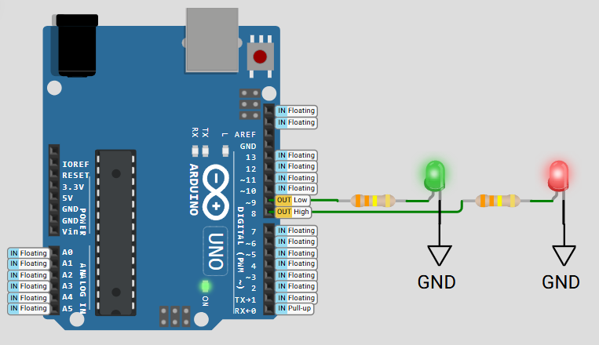

# FreeRTOS Dual LED Blinking with Arduino UNO  
## Real-Time Task Scheduling Demonstration

---

## 📘 Project Overview

This project demonstrates how to run two independent tasks on an **Arduino UNO** using **FreeRTOS**. Each task controls a separate LED, allowing us to observe multitasking behavior and precise timing under a real-time operating system.

The goal is to showcase how FreeRTOS handles concurrent tasks with different delay periods, and how each LED can be controlled independently without blocking the other — a fundamental benefit of real-time multitasking in embedded systems.

---

## 🧰 Component Requirements  

This circuit, built and simulated using **Wokwi Simulator**, shows two LEDs connected to digital pins of the Arduino UNO:

- **Arduino UNO** (simulated)
- **Red LED** connected to **Pin 8**
- **Green LED** connected to **Pin 9**

---

## ⚙️ Task Behavior

Two FreeRTOS tasks are created in this project:

### 🔴 Task 1: Red LED on Pin 8
- Blinks with a **1 second period**
- 500 ms ON, 500 ms OFF

### 🟢 Task 2: Green LED on Pin 9
- Blinks with a **0.5 second period**
- 250 ms ON, 250 ms OFF

These tasks are scheduled concurrently using FreeRTOS, allowing both LEDs to blink at different rates **without interfering with each other**.

---

## 🔍 Key Takeaways

- Demonstrates **basic FreeRTOS task creation** on Arduino.
- Shows how multitasking can control multiple outputs in parallel.
- A practical example for understanding **task timing** and **non-blocking execution**.
- Ideal for getting started with **real-time embedded programming** on Arduino.

---

## 🧠 Learning Outcomes

- Understand how `vTaskDelay()` works to schedule periodic tasks.
- Learn to structure simple RTOS-based applications using `xTaskCreate()`.

---

