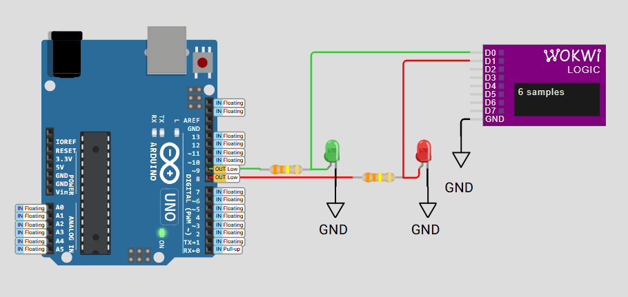
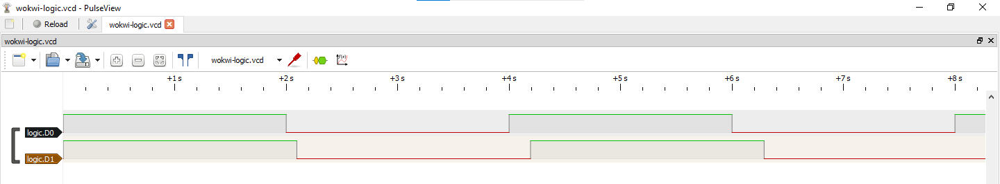

# FreeRTOS Delay Comparison: Understanding Timing Precision in Real-Time Systems

## 📘 Project Overview

This project demonstrates and compares two fundamental delay mechanisms in **FreeRTOS**: `vTaskDelay` and `vTaskDelayUntil`.  
The **primary goal** is to help embedded developers understand the critical difference between **relative** and **absolute** timing in real-time systems.

### 🔎 Why This Comparison Matters

- Real-time applications require predictable, consistent timing.
- Sensor sampling, motor control, and communication protocols depend on precise periodicity.
- Understanding timing drift helps developers choose the right delay mechanism for their specific use case.
- System reliability can be compromised when tasks don’t execute at expected intervals.

This demonstration visualizes the **timing accuracy** and **periodicity** of both methods using an Arduino UNO and logic analyzer output — making the abstract concept of timing drift tangible and measurable.

---

## 🧰 Component Requirements

This project is simulated using the **Wokwi Simulator** and includes the following:

- **Arduino UNO** running FreeRTOS with two concurrent tasks.
- **Logic Analyzer** to visualize and measure timing behavior.
- **Two LEDs** connected to pins 8 & 9 to show timing differences.

> ℹ️ *The logic analyzer is critical to this demonstration, as it reveals timing details that are not observable through LEDs alone.*

---

## 📷 Logic Analyzer Output

In the waveform above:

- **Red trace (Pin 8)**: Task using `vTaskDelay` — shows gradual timing drift.
- **Green trace (Pin 9)**: Task using `vTaskDelayUntil` — maintains consistent 2.000s periods.

This output clearly demonstrates why **absolute timing** via `vTaskDelayUntil` is essential for time-critical applications.

---

## 📊 Core Findings

| Method            | Measured Period | Expected Period | Timing Error    |
|-------------------|------------------|------------------|------------------|
| `vTaskDelay`      | 2.100 s          | 2.000 s          | +100 ms drift    |
| `vTaskDelayUntil` | 2.000 s          | 2.000 s          | 0 ms (precise)   |

---

## ℹ️ Why is Pin 8 slower than Pin 9?

The difference lies in **how delays are calculated**:

- 🔴 `vTaskDelay` (Pin 8) adds a **fixed delay after the task finishes executing**. With an execution time of ~100ms and a delay of 2000ms, the actual period becomes **2100ms**.
- 🟢 `vTaskDelayUntil` (Pin 9) schedules the task to run at **strict 2000ms intervals**, automatically compensating for the 100ms execution time. Hence, it maintains a precise **2.000s** toggle rate.

---

## 🔍 Key Insights & Practical Implications

### 🕒 Critical Differences

#### `vTaskDelay` (Relative Timing)

- Delay is calculated from the **actual wake-up time**.
- Accumulates **drift** due to execution time and system overhead.
- 🧩 **Use case**: Simple delays, non-critical timing (e.g., blinking LEDs).
- ❗ **Limitation**: Execution time (~100ms in our test) causes equal drift each cycle.

#### `vTaskDelayUntil` (Absolute Timing)

- Delay is calculated from a **fixed reference point**.
- Maintains **precise periodicity** despite execution variations.
- 🧩 **Use case**: Sensor sampling, PWM, communication protocols.
- ✅ **Advantage**: Compensates automatically for execution delays.

---

### 🌍 Real-World Impact

- **Sensor Sampling**: Drift affects data acquisition timing.
- **Motor Control**: Inconsistent cycles may cause vibration or instability.
- **Communication Protocols**: Drift can violate protocol timing constraints.
- **Power Management**: Timing uncertainty can skew energy consumption estimates.

---

### 📈 Performance Observations

- `vTaskDelay` completes cycles ~5% slower than intended due to drift accumulation.
- ~1.5% timing variance between HIGH and LOW states highlights inconsistency.
- Over long runtimes, the timing drift becomes more pronounced with `vTaskDelay`.

---

## 🚀 Practical Recommendations

### ✅ Use `vTaskDelay` when:

- Timing precision isn’t critical.
- You only need to delay for **at least** a certain duration.
- Performing user feedback or LED toggling.

### ✅ Use `vTaskDelayUntil` when:

- Precise periodic timing is required.
- Consistency is essential (e.g., sensor polling, PWM signals).
- Developing real-time applications.

---
