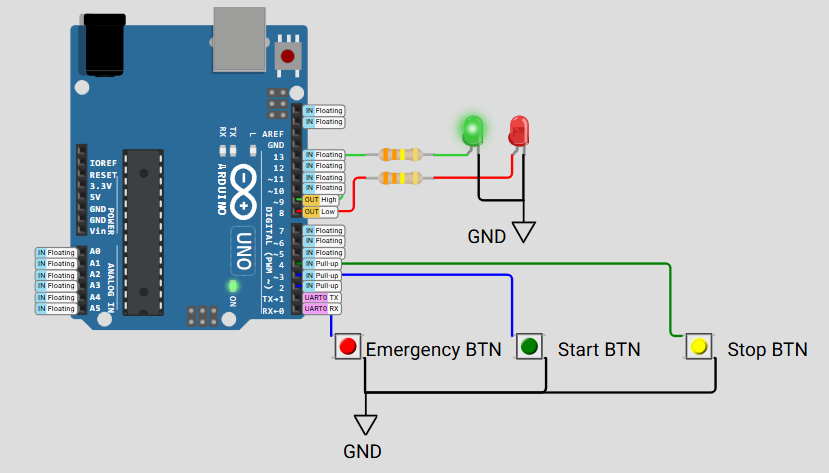

# FreeRTOS Task Priority and Control: Demonstrating vTaskSuspend and vTaskResume

## 📘 Project Overview

This project demonstrates the use of **FreeRTOS task management APIs** — specifically `vTaskSuspend()` and `vTaskResume()` — alongside task priorities to control the behavior of multiple tasks running concurrently on an Arduino Uno.

The system simulates a simple control panel with:

- A **green LED** blinking periodically, representing normal operation.
- A **red LED** indicating an emergency state.
- Three buttons for user interaction: **Emergency**, **Start**, and **Stop**.

### 🔎 Why This Project Matters

- Highlights how task priorities affect scheduling and responsiveness.
- Demonstrates how tasks can be dynamically suspended and resumed.
- Shows practical use of button interrupts in a multitasking environment.
- Useful for embedded developers learning task control in FreeRTOS.

---

## 🧰 Component Requirements

This project is simulated using the **Wokwi Simulator** and includes the following components:

- Arduino Uno or compatible board running FreeRTOS.
- 2 LEDs connected to pins 8 (Red LED) and 9 (Green LED).
- 3 Push buttons connected to pins 2 (Emergency), 3 (Start), and 4 (Stop).
- Buttons wired with internal pull-up resistors enabled in code (`INPUT_PULLUP`).

> ⚠️ *Note*: Buttons are active low — pressing the button connects the pin to GND.

---

## 🔄 How It Works

### Tasks and Priorities:

| Task Name    | Functionality                                | Priority |
|--------------|---------------------------------------------|----------|
| Blink        | Blinks the green LED every 500 ms            | 1 (Low)  |
| Emergency    | Detects emergency button press, suspends Blink, lights red LED | 3 (High) |
| Start        | Starts or resumes blinking if no emergency   | 2 (Medium)|
| Stop         | Stops blinking and turns off green LED       | 2 (Medium)|

### Task Behavior:

- **Blink Task**: Continuously toggles green LED ON/OFF every 500 ms when running.
- **Emergency Task**: Monitors Emergency button; if pressed, suspends Blink task, turns red LED ON.
- **Start Task**: Monitors Start button; starts or resumes Blink task only if no emergency.
- **Stop Task**: Monitors Stop button; suspends Blink task and turns green LED OFF.

---

## 📋 Code Highlights

- The **Blink task** can be dynamically suspended and resumed using the task handle and FreeRTOS APIs `vTaskSuspend()` and `vTaskResume()`.
- Emergency task has the **highest priority** to ensure immediate response.
- Start and Stop tasks share a **medium priority** to handle user commands without blocking the emergency response.
- Buttons use `INPUT_PULLUP` mode for simple wiring and debounce logic handled by polling every 50 ms.

---

## 🔧 Running the Project

1. Connect the LEDs and buttons as per the pin definitions:
   - Red LED: Pin 8
   - Green LED: Pin 9
   - Emergency Button: Pin 2
   - Start Button: Pin 3
   - Stop Button: Pin 4

2. Upload the code to your Arduino board.

3. Open the Serial Monitor at 9600 baud to observe status messages:
   - When emergency is activated.
   - When system starts or resumes.
   - When system stops.

4. Use buttons to control the system and watch LEDs change accordingly.

---

## 🚦 Expected Behavior

| Button Pressed       | Effect                                      |
|----------------------|---------------------------------------------|
| Emergency (Pin 2)     | Red LED ON, Green LED OFF, Blink task suspended |
| Start (Pin 3)         | Resume Blink task if no emergency            |
| Stop (Pin 4)          | Suspend Blink task, Green LED OFF           |

---

## 🧠 Key Learning Points

- **Task suspension and resumption** allow flexible control of task execution.
- **Task priority** ensures emergency signals are handled immediately.
- Button polling with debouncing can be done inside FreeRTOS tasks without blocking other tasks.
- Clear separation of responsibilities enhances real-time system design.

---

## ⚙️ Technical Details

- FreeRTOS tasks created with appropriate priorities.
- Task handles used to control suspension and resumption.
- Use of `volatile` variables to safely share state between tasks.
- Polling buttons every 50 ms balances responsiveness and CPU usage.

---

## 📚 References

- [FreeRTOS API Documentation](https://www.freertos.org/a00106.html)
- Arduino_FreeRTOS Library for Arduino Uno
- Embedded Systems multitasking concepts
