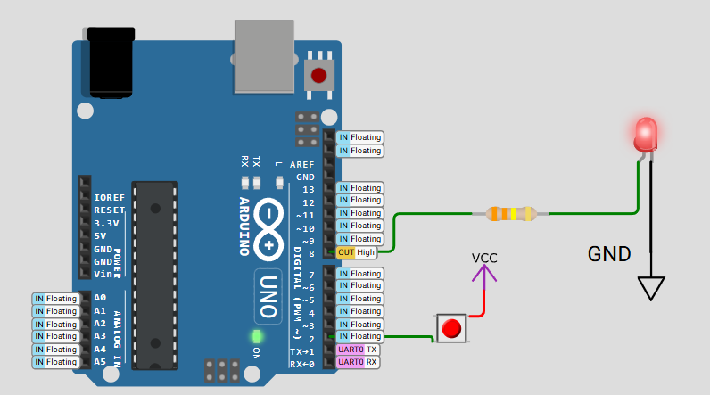

# FreeRTOS Queue Communication Demo  
**Button-to-LED Control with Message Passing**

## 📋 Project Overview  
Demonstrates inter-task communication in FreeRTOS using queues to:  
1. Detect button state changes (debounced)  
2. Send "ON"/"OFF" messages between tasks  
3. Control an LED based on received messages  

  
*Wokwi simulation of Arduino UNO with button and LED*

## 🛠️ Key Components  
- **Input**: Pushbutton (Pin 2)  
- **Output**: LED (Pin 8)  
- **Communication**: FreeRTOS queue (5 message capacity)  

## ⚙️ Core Functionality  

### Task 1: Button Monitor  
- Debounces button input (50ms delay)  
- Detects state changes (HIGH/LOW)  
- Sends "ON" or "OFF" messages via queue  

### Task 2: LED Controller  
- Listens for queue messages  
- Turns LED on/off based on received commands  
- Prints all actions to Serial Monitor  

## 📊 Expected Behavior  
| Action          | Serial Output         | LED State  |  
|-----------------|-----------------------|------------|  
| Button Pressed  | `Sent: ON` `Received: ON`  | Lights ON  |  
| Button Released | `Sent: OFF` `Received: OFF` | Lights OFF |  

## 🔌 Circuit Connections  
```plaintext
Arduino UNO:
  Pin 2 → Button → GND (with pull-up enabled)
  Pin 8 → LED → Resistor → GND
---

## 📝 Key Features
- Message-based task synchronization
- Hardware debouncing (software + delay)
- Queue overflow protection
- Real-time status monitoring via Serial