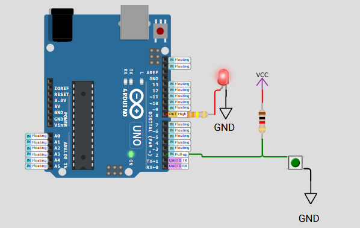

# FreeRTOS Binary Semaphore Demo  
**Task Synchronization with Button-Controlled LED Access**

---

## 📘 Project Overview

This project demonstrates **task synchronization and mutual exclusion** using a **FreeRTOS binary semaphore** on an **Arduino Uno**.  
Two tasks — `LED_ON_Task` and `LED_OFF_Task` — coordinate to control a shared critical resource: a red LED.

A **pushbutton** is used to toggle the LED:  
- **Pressing** the button **turns OFF** the LED.  
- **Releasing** the button **turns ON** the LED.

To highlight proper semaphore usage, a **1-second delay** simulates the **occupation of the critical section**.

---

## 🧰 Component Requirements

Simulated using the **Wokwi Simulator**, this project includes:

- Arduino Uno (FreeRTOS-compatible)  
- Pushbutton on **Pin 2**  
- Red LED on **Pin 8**  
- Internal pull-up resistor enabled (`INPUT_PULLUP`)  

> ⚠️ *Note:* Button is **active-low** — logic `LOW` when pressed.

---

## 🔄 How It Works

### Task Behavior and Synchronization:

| Task Name     | Trigger              | Action                               | Semaphore Role       |
|---------------|----------------------|--------------------------------------|-----------------------|
| LED_OFF_Task  | Button **pressed**   | Turns LED OFF, holds for 1 sec       | Acquires + releases   |
| LED_ON_Task   | Button **released**  | Turns LED ON, holds for 1 sec        | Acquires + releases   |

---

### Task Flow Summary

- **Binary semaphore** ensures **mutual exclusion** of the red LED.  
- **LED_OFF_Task** runs when the button is pressed (LOW):  
  - Acquires the semaphore  
  - Turns the LED **OFF**  
  - Waits **1 second**  
  - Releases the semaphore  
- **LED_ON_Task** runs when the button is released (HIGH):  
  - Acquires the semaphore  
  - Turns the LED **ON**  
  - Waits **1 second**  
  - Releases the semaphore  

---

## 📟 Serial Output Example

| Event                  | Serial Output                          |
|------------------------|----------------------------------------|
| Button Pressed         | `LED OFF Task: Acquired Semaphore`     |
|                        | `LED OFF Task: LED turned OFF`         |
|                        | `LED OFF Task: Released Semaphore`     |
| Button Released        | `LED ON Task: Acquired Semaphore`      |
|                        | `LED ON Task: LED turned ON`           |
|                        | `LED ON Task: Released Semaphore`      |

---

## 🛠️ Running the Project
- Open the project in the Wokwi Simulator or upload it to your Arduino Uno.
- Monitor the Serial Console at 9600 baud for task messages.
- Press and release the button to observe LED behavior
- Each task waits 1 second inside the critical section after acquiring the semaphore.

---

## 🚦 Expected Behavior

| Button State    | LED State | Semaphore Status     |
| --------------- | --------- | -------------------- |
| Pressed (LOW)   | OFF       | Acquired by OFF Task |
| Released (HIGH) | ON        | Acquired by ON Task  |

---

## 🧠 Key Learning Points
- Demonstrates task coordination using binary semaphores
- Reinforces critical section access with artificial delay
- Practical example of FreeRTOS multitasking and mutual exclusion
- Integrates user input to drive system behavior

---

## ⚙️ Technical Highlights

- Binary semaphore created via xSemaphoreCreateBinary()
- Tasks run concurrently under FreeRTOS
- LED is a shared critical resource protected by semaphore
- Task polling frequency: every 50 ms
- 1-second vTaskDelay() simulates protected execution

---

📚 References
- [FreeRTOS API Documentation](https://www.freertos.org/a00106.html)
- Arduino_FreeRTOS Library
- Wokwi Arduino Simulator: [wokwi.com](https://wokwi.com/)

