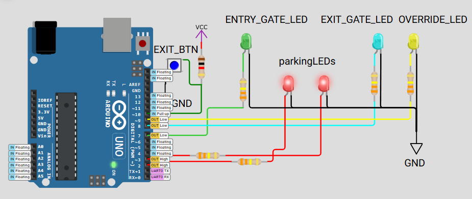

# 🚗 FreeRTOS Parking Lot Simulation Using Counting Semaphore

## 📘 Project Overview

This project simulates a **Parking lot** on an **Arduino Uno** using **FreeRTOS**. It showcases the **impact and usage of a counting semaphore** to manage concurrent access to **limited parking spaces**.

### 🎯 Core Objective

🔐 Demonstrate how a **counting semaphore** enables:
- **Simultaneous task coordination**
- **Limited access to a shared resource** (parking spaces)
- **Safe task management without race conditions**

---

## 🧰 Hardware Simulation (Wokwi Compatible)

 

| Component             | Pin            |
|-----------------------|----------------|
| Entry Gate LED        | 7              |
| Exit Gate LED         | 8              |
| Override Indicator    | 9              |
| Exit Button (active LOW) | 10         |
| Parking Slot 1 LED    | 2              |
| Parking Slot 2 LED    | 3              |

> ✅ **Internal Pull-up resistor** used for the exit button (INPUT_PULLUP)

---

## 🔄 System Behavior

This simulation features **2 parking spots** and **3 virtual cars** represented by FreeRTOS tasks. Each car tries to **enter, occupy, and exit** a parking spot. If no spots are available, they **block** until a spot is freed.

### Task Summary

| Task Name        | Behavior                                                                 |
|------------------|--------------------------------------------------------------------------|
| `CarTask1`       | Attempts to park, uses slot 1, exits after delay                         |
| `CarTask2`       | Similar to Car 1, staggered start, uses slot 2                           |
| `ExitButtonTask` | Monitors physical button to **manually free** a parking spot             |

---

## 🎛️ Semaphore Details

- **Semaphore Type**: Counting  
- **Max Count**: 2 (equal to total parking spots)  
- **Initial Count**: 2  
- **Role**: Controls how many "cars" can park simultaneously.

> 🧠 **Key Insight**: The counting semaphore acts like a "parking token dispenser". Cars must get a token (semaphore) to park. If no token is available, they wait.

---

## 🧠 Key Learning Points

✅ Understand **counting vs binary semaphores**  
✅ Observe **task blocking behavior** when the resource is exhausted  
✅ Learn how a **manual override** can influence semaphore behavior  
✅ Reinforce **multi-task scheduling and shared resource control** in FreeRTOS

---

## 🧪 Serial Output Example
```
Parking lot system started!
Total parking spaces: 2
Car 1: Entered parking
Car 1: Parked. Spaces left: 1
Car 2: Entered parking
Car 2: Parked. Spaces left: 0
Car 1: Left parking
Car 2: Left parking
Override: Manual exit triggered
Spaces available: 2

``` 


---

## 🚦 LED Behavior Table

| LED               | Purpose                          | State Behavior               |
|------------------|----------------------------------|------------------------------|
| Entry Gate LED   | Briefly ON when car enters       | 200ms HIGH pulse             |
| Exit Gate LED    | Briefly ON when car exits        | 200ms HIGH pulse             |
| Parking LEDs     | Indicates active parking slot    | HIGH = Occupied              |
| Override LED     | Manual button triggered override | ON for 500ms after press     |

---

## 📟 Button Interaction

- **Exit Button (Pin 10)**:  
  - When **pressed**, it forces a parking space to be released.  
  - Useful for handling emergency exits or faulty parking logic.

---

## 🛠️ Running the Project

1. Open in **Wokwi** or upload to an **Arduino Uno** with FreeRTOS support.
2. Watch the **Serial Monitor** at 9600 baud for debug messages.
3. Observe how tasks block and wait for parking availability.
4. Press the **exit button** to manually release a parking space.

---

## 🔍 Technical Breakdown

| Feature                     | Details                                     |
|-----------------------------|---------------------------------------------|
| Scheduler                   | Preemptive (FreeRTOS)                       |
| Delay & Timing              | `vTaskDelay` with `pdMS_TO_TICKS()`        |
| Semaphore API               | `xSemaphoreCreateCounting`, `xSemaphoreTake`, `xSemaphoreGive` |
| Task Prioritization         | Exit task priority = 2 (higher)            |
| Task Loop Timing            | Car 1 loops every ~5s, Car 2 every ~6s     |

---

## 📚 References

- [FreeRTOS Counting Semaphores](https://www.freertos.org/Counting-semaphores.html)
- [Arduino FreeRTOS Port](https://freertos.org/Arduino/FreeRTOS-quick-start.html)
- [Wokwi Simulator Docs](https://docs.wokwi.com/)

---


