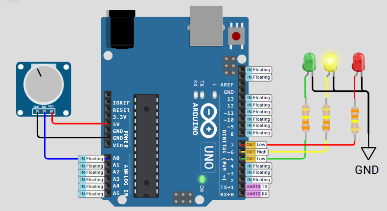

# 🎛️ FreeRTOS ADC Monitoring and LED Indicator Using Mutex

## 📘 Project Overview

This project simulates a **sensor-based status indicator system** using an **Arduino Uno** and **FreeRTOS**. It demonstrates the use of a **mutex** (mutual exclusion semaphore) to safely manage access to a **shared ADC value** across multiple tasks.

### 🎯 Core Objective

🔐 Showcase how a **mutex** ensures:
- **Safe access to shared data**
- **Synchronized task communication**
- **Real-time behavior with concurrent task execution**

---

## 🧰 Hardware Simulation (Wokwi Compatible)



| Component          | Pin   |
|--------------------|-------|
| Potentiometer      | A0    |
| Red LED            | 5     |
| Yellow LED         | 6     |
| Green LED          | 7     |

> ✅ **Analog sensor (potentiometer)** simulates input voltage ranging from 0–1023.

---

## 🔄 System Behavior

This system reads analog input using `analogRead()` and **updates LEDs** based on the current ADC value range. It uses **FreeRTOS tasks** for sensor reading, data printing, and LED control — all accessing a **shared variable protected by a mutex**.

### Task Summary

| Task Name         | Behavior                                                                 |
|-------------------|--------------------------------------------------------------------------|
| `TaskReadADC`     | Reads analog value every 50ms, updates shared variable                   |
| `TaskPrintADC`    | Prints current ADC value to Serial every 200ms                           |
| `TaskControlLEDs` | Controls red/yellow/green LEDs based on ADC level every 100ms            |

---

## 🔐 Mutex Usage

- **Semaphore Type**: Binary Mutex  
- **Resource Protected**: Shared `adcValue`  
- **Role**: Ensures only one task accesses/modifies `adcValue` at a time

> 🧠 **Key Insight**: Without a mutex, tasks might read or write corrupted data due to race conditions.

---

## 💡 LED Logic Mapping

| ADC Value Range | LED State                  |
|------------------|----------------------------|
| 0 – 340          | 🔴 Red ON                  |
| 341 – 681        | 🟡 Yellow ON               |
| 682 – 1023       | 🟢 Green ON                |

---

## 🧠 Key Learning Points

✅ Understand how to use **FreeRTOS mutex** to prevent data races  
✅ Observe **safe task communication** with shared data  
✅ Reinforce **multi-task LED control** using real-time input  
✅ Develop **low-latency polling loops** for sensor input  

---

## 🧪 Serial Output Example

```
ADC Monitoring System Started
ADC Value: 120
ADC Value: 135
ADC Value: 145
```
---

## 📟 Timing and Scheduler Details

| Feature              | Description                            |
|----------------------|----------------------------------------|
| Scheduler Type       | Preemptive (FreeRTOS)                  |
| Task Priorities      | Read = 2, Print = 1, LED Control = 1   |
| ADC Read Interval    | 50ms                                   |
| Serial Print Interval| 200ms                                  |
| LED Update Interval  | 100ms                                  |

---

## 🛠️ Running the Project

1. Open the project in **Wokwi** or upload to an **Arduino Uno** with FreeRTOS support.
2. Connect a **potentiometer** to pin A0 for analog input.
3. Observe the **LED behavior** in real time as the ADC value changes.
4. Monitor the **Serial Output** for real-time ADC readings.

---

## 📚 References

- [FreeRTOS Mutex Tutorial](https://www.freertos.org/Embedded-RTOS-Mutexes.html)
- [Arduino FreeRTOS Quick Start](https://freertos.org/Arduino/FreeRTOS-quick-start.html)
- [Wokwi Arduino Simulator](https://docs.wokwi.com/)

---
